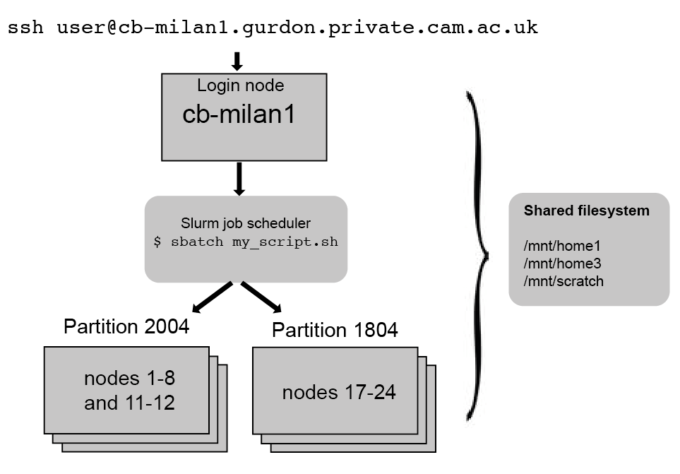
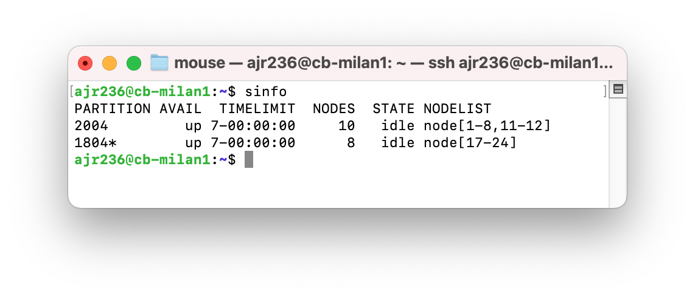
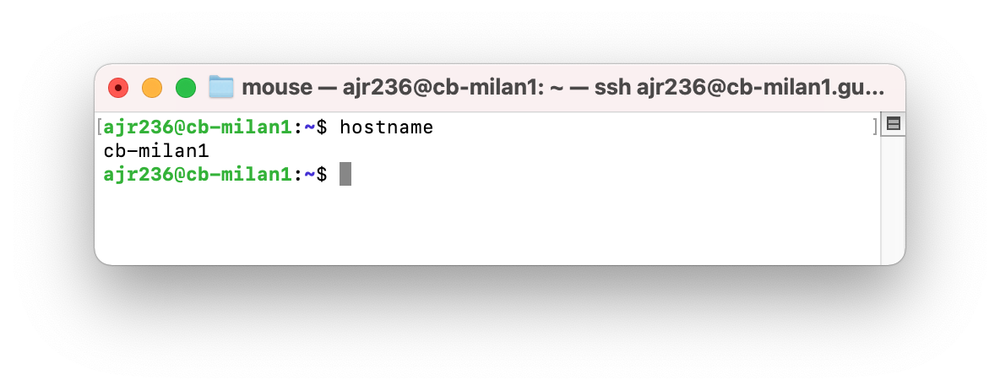
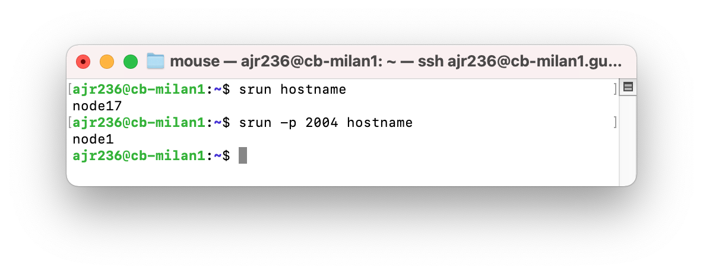
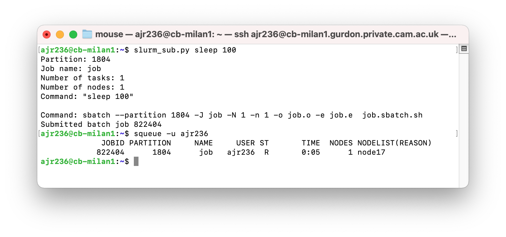

# Bioinformatics on the cluster

Author: Adam Reid, Head of Bioinformatics, Gurdon Institute, University of Cambridge
Email: ajr236@cam.ac.uk

Some of this material has been remixed from training materials developed by University of Cambridge Bioinformatics Training Facility [course on High Performance Computing](https://cambiotraining.github.io/hpc-intro/), Licensed [CC BY 4.0](https://creativecommons.org/licenses/by/4.0/)

### Aim of the course

- Teach users the basics of how to use the Gurdon Institute compute cluster (skynet)

### Learning outcomes
- You will be able to access the cluster, move files to and from your own computer and the internet
- You will be able to submit jobs using the Slurm submission system
- You will be able to access Rstudio server
- You will be aware of suitable places for storing files

### Pre-requisites
- Some Linux command-line knowledge
- A cluster account (contact [Charles](mailto:crb55@cam.ac.uk))

## Contents

- [Part 1 Introduction to the cluster](#part-1-introduction-to-the-cluster)
  - [What is a cluster and what are its uses?](#what-is-a-cluster-and-what-are-its-uses?)
  - [The Gurdon compute cluster](#the-gurdon-compute-cluster)
  - [Getting on the cluster](#getting-on-the-cluster)
  - [Moving files](#moving-files)
  - [Practical 1](#practical-1)
- [Part 2 Submitting jobs](#part-2-submitting-jobs)
  - [Slurm job scheduler](#slurm_job_scheduler)
  - [Practical 2](#practical-2)
- [Part 3 Rstudio and installing software](#part-3-rstudio-and-installing-software)
  - [RStudio server](#rstudio-server)
  - [Installing software](#installing-software)
- [Appendix](#appendix)

## Part 1 Introduction to the cluster
### What is a cluster and what are its uses?

The terms __cluster__, __compute cluster__, __HPC (high performance computing)__ and __farm__ are often used interchangeably to mean the same thing - several computers connected together in a network. Each computer is referred to as a **node** in the network. 

The main usage of HPC clusters is to run resource-intensive and/or parallel tasks.

For example: running thousands of simulations, each one taking several hours; assembling a genome from sequencing data, which requires computations on large volumes of data in memory; or mapping hundreds of RNA-seq samples to a reference.

These tasks would be extremely challenging to complete on a regular computer. However, they are just the kind of task that a HPC cluster would excel at. 

When working on a cluster it is important to understand what kinds of _resources_ are available to us. 

These are the main resources we need to consider:

- **CPU** (central processing units) is the "brain" of the computer, performing a wide range of operations and calculations. 
CPUs can have several "cores", which means they can run tasks in parallel, increasing the throughput of calculations per second. 
A typical personal computer may have a CPU with 4-8 cores. 
A single compute node on the HPC may have 32-48 cores (and often these are faster than the CPU on our computers).

- **RAM** (random access memory) is a quick access storage where data is temporarily held while being processed by the CPU. 
A typical personal computer may have 8-32Gb of RAM. 
A single compute nodes on a HPC may often have >100Gb RAM.

- **GPUs** (graphical processing units) are similar to CPUs, but are more specialised in the type of operations they can do. While less flexible than CPUs, each GPU can do thousands of calculations in parallel. 
This makes them extremely well suited for graphical tasks, but also more generally for matrix computations and so are often used in machine learning applications. 

Usually, HPC clusters are available to members of large institutions (such as a Universities or research institutes) or sometimes from cloud providers. 
This means that:

- There are many users, who may simultaneously be using the cluster. 
- Each user may want to run several jobs concurrently. 
- Often large volumes of data are being processed and there is a need for high-performance storage (allowing fast read-writting of files).

So, at any one time, across all the users, there might be many thousands of processes running on the cluster!
There has to be a way to manage all this workload, and this is why HPC clusters are typically organised somewhat differently from what we might be used to when we work on our own computers. 

Here is a schematic of a cluster, we go into its details in the following sections. 


### Nodes

There are two types of nodes on a cluster: 

- _login_ nodes (also known as _head_ or _submit_ nodes).
- _compute_ nodes (also known as _worker_ nodes).

The **login nodes** are the computers that the user connects to and from where they interact with the cluster. 
Depending on the size of the cluster, there is often only one login node, but larger clusters may have several of them. 
Login nodes are used to interact with the filesystem (move around the directories), download and move files, edit and/or view text files and doing other small routine tasks. 

The **compute nodes** are the machines that will actually do the hard work of running jobs.
These are often high-spec computers with many CPUs and high RAM (or powerful GPU cards), suitable for computationally demanding tasks.
Often, there are several "flavours" of compute nodes on the same cluster. 
For example some compute nodes may have fewer CPUs but higher memory (suitable for memory-intensive tasks), while others may have the opposite (suitable for highly-parallelisable tasks). 

Users do not have direct access to the _compute nodes_ and instead submitting jobs via a _job scheduler_.

### The Gurdon compute cluster



#### Filesystem

The filesystem on a HPC cluster often consists of storage partitions that are shared across all the nodes, including both the login and compute nodes. This means that data can be accessed from all the computers that compose the HPC cluster.

Although the filesystem organisation may differ depending on the institution, typical HPC servers often have two types of storage:

The user's home directory (e.g. /mnt/home1/user) is the default directory that one lands on when logging in to the HPC. This is often quite small and possibly backed up. The home directory can be used for storing things like configuration files or locally installed software.

A scratch space (e.g. /mnt/scratch/user), which is high-performance, large-scale storage. This type of storage may be private to the user or shared with a group. It is usually not backed up, so the user needs to ensure that important data are stored elsewhere. This is the main partition were data is processed from.

At the Gurdon Institute we have:

- __home1__ (/mnt/home1/user)

  Features: limits on home directory size (1Tb) and file number, backed up

  Useful for: Installing software and backing up results
   
- __home3__ (/mnt/home3/user)

  Features: limited total space (4 Tb), backed up

  Useful for: Conda environments, Java jar files

- __scratch__ (/mnt/scratch/user)

  Features: no quotas (~1 Petabyte total), not backed up

  Useful for: Running compute jobs, generating lots of intermediate files

- __Datastore__ /mnt/Sequencing and smb://datastore.computing.gurdon.cam.ac.uk/Sequencing

  Useful for: where to find your Gurdon and CI sequencing data
  
For backed up directories it is important to avoid large numbers of files and non-work related files as this slows down back-ups and reduces space available for others.


#### Where is my sequencing data?

Sequencing data is kept in the Sequencing Datastore. This is accessible from your computer by mounting this samba drive `smb://datastore.computing.gurdon.cam.ac.uk` e.g. using *Finder* -> *Go* -> *Connect to Server* and pasting in the link on a Mac.

This Sequencing Datastore is also mounted on the compute cluster at `/mnt/Sequencing`.

For samples sequenced at CI, data is automatically downloaded to:

  `//Datastore/Sequencing/(GL Folder)/CI FASTQ/` on the samba share and `/mnt/Sequencing/(GL Folder)/CI FASTQ/` on cb-milan1

  (ftp server is checked nightly at 0300)

For samples sequenced at the Gurdon Institute, raw data is manually compressed and copied to:

  `//Datastore/Sequencing/(GL Folder)/Run Folder/`

FASTQ files are manually copied to (Kay Harnish):

  `//Datastore/Sequencing/(GL Folder)/Basespace FASTQ/`

Manually demultiplexed FASTQ files (CI or GI):

  `//Datastore/Sequencing/(GL Folder)/CB FASTQ/`
  

### Getting on the cluster

If you are using a Mac:

Open __terminal__ from *Spotlight Search* or this icon:


If you are on a PC:

Open __Command Prompt__ with this icon:


Then type:

```
ssh <user>@cb-milan1.gurdon.private.cam.ac.uk
```
  
e.g.
```
ssh ajr236@cb-milan1.gurdon.private.cam.ac.uk
```

### Moving files

#### scp - move files between your computer and the cluster

Copy a file from cluster to my computer (from my computer)

```
scp ajr236@cb-milan1.gurdon.private.cam.ac.uk:/mnt/home1/reid/ajr236/graph.png .
```

Copy a file from my computer to the cluster (from my computer)

```
scp graph.png ajr236@cb-milan1.gurdon.private.cam.ac.uk:/mnt/home1/reid/ajr236/
```

#### wget – get files from the internet

```
wget http://ftp.flybase.net/genomes/dmel/current/gtf/dmel-all-r6.43.gtf.gz
```

N.b. To run visualisations you will need to copy your files to your local computer

### Practical 1

1. ssh to the cluster

2. Make a new directory in your homespace called `tutorial` and move into that directory

3. Get the `automated_gene_summaries.tsv.gz` file from [flybase](http://ftp.flybase.org/releases/FB2021_06/precomputed_files/genes/) using wget 

4. Copy the file from the cluster to your local machine using `scp`

  - Open a new terminal

  - scp `automated_gene_summaries.tsv.gz` from <username>@cb-milan1.gurdon.private.cam.ac.uk:<path>

5. Unzip the file on the command line using `gunzip`

6. Check the file contents

7. Get just the first ten lines and make a new file called `head.txt`

8. Copy `head.txt` to the cluster with `scp`


## Part 2 Submitting jobs
  
HPC servers usually have job scheduling software that manages all the jobs that the users submit to be run on the compute nodes. This allows efficient usage of the compute resources (CPUs and RAM), and the user does not have to worry about affecting other people's jobs.

We discussed __nodes__ and __CPUs__ above. When submitting your jobs to a cluster there are several other useful terms to know. Not least:

- **Job** : a unit of work, with resource requests and steps to be run
- **Thread** : single process running on a core
- **Queue/Partition** : a group of nodes with particular characteristics e.g. resources, software 
  
The job scheduler uses an algorithm to prioritise the jobs, weighing aspects such as:

- how much time did you request to run your job?
- how many resources (CPUs and RAM) do you need?
- how many other jobs have you got running at the moment?

  Based on these, the algorithm will rank each of the jobs in the queue to decide on a "fair" way to prioritise them. Note that this priority dynamically changes all the time, as jobs are submitted or cancelled by the users, and depending on how long they have been in the queue. For example, a job requesting many resources may start with a low priority, but the longer it waits in the queue, the more its priority increases.

This can be thought of like managing tables at a restaurant
  

  
Why not just run jobs on the head node?
- It doesn't allow fair distribution of resources
- You know that your job will get the resources you need
- Helps with record-keeping and troubleshooting
- Job gets run in the background (go for a coffee!)
- More power – faster runs
- Parallelisation!!!

When should I use the head nodes?
- Editing text files
- Basic UNIX commands – mv, cp, rm etc.
- Managing data
- Short, low-memory processes
- Testing – with simple example data for fast turn around
- For submitting jobs
- Monitoring jobs
- Post processing

### Slurm job scheduler

On the Gurdon cluster (and on the [University of Cambridge HPC cluster](https://docs.hpc.cam.ac.uk/hpc/)) the job scheduler is __Slurm__

There are several Slurm programs which allow submission and management of jobs
  
#### Examining the available queues and node status

`sinfo` will tell you about the partitions and what resources are available
  

  
down = not in use
  
drng/drain = removed by administrator

mix = some CPUs allocated some idle

idle = available 

alloc = node in use
  
#### Examining pending and running jobs

!!! Add image here

```
squeue
squeue -u <username>
```

To get detailed parameters about a job:
  
`sacct --format jobname,account,state,AllocCPUs,reqmem,maxrss,averss,elapsed -j <jobid>`

To get parameters about a finished job, such as how long it took, how much memory it used and whether it failed or not
  
`seff <jobid>`

This will give you output such as (as well as some warnings from Perl which you can ignore):

```
Job ID: 822393
Cluster: skynet
User/Group: /reid
State: FAILED (exit code 2)
Nodes: 1
Cores per node: 2
CPU Utilized: 00:00:00
CPU Efficiency: 0.00% of 00:00:00 core-walltime
Job Wall-clock time: 00:00:00
Memory Utilized: 1.14 MB
Memory Efficiency: 0.01% of 7.81 GB
```

*Memory Utilized* is particularly useful for determining how much memory to ask for in the future when running similar jobs.
  
To kill a job:

```
scancel <jobid>
```
  
#### Submitting a job
  
- srun

   Interactive, typically for MPI jobs– “proper” parallel computing

- salloc
  
  Interactive shell with job allocation – bit like logging into a virtual machine

- sbatch

  “embarrassingly” parallel computing – i.e. most bioinformatics

  Submit jobs for non-interactive execution

  Requires writing a bash script

- slurm_sub.py
  
  Custom script which makes running sbatch easy and has added reporting

### Batch scripts (sbatch)

- Allow multiple steps to be run in a single job
- Ideal for small bioinformatics workflows
- Submitted in the background and allows for good reporting
- Set up scheduling parameter templates rather than typing them at execution

```
#!/bin/bash
#SBATCH --job-name=parallel_job # Job name 
#SBATCH --mail-type=END,FAIL # Mail events (NONE, BEGIN, END, FAIL, ALL) 
#SBATCH --mail-user=email@ufl.edu # Where to send mail 
#SBATCH --nodes=1 # Run all processes on a single node 
#SBATCH --ntasks=1 # Run a single task 
#SBATCH --cpus-per-task=4 # Number of CPU cores per task 
#SBATCH --mem=1gb # Job memory request 
#SBATCH --time=00:05:00 # Time limit hrs:min:sec
#SBATCH --output=parallel_%j.log # Standard output and error log 
pwd; hostname; date

echo "Running sleep program on $SLURM_CPUS_ON_NODE CPU cores" 

sleep 10 

date
```
  
### slurm_sub.py

This is a custom script which makes submitting sbatch jobs easier
  
It is located at `/mnt/home3/slurm/slurm_sub.py`. Simple things can be run very simply e.g. `slurm_sub.py sleep 10`

- STDOUT goes to job.o
- STERR goes to job.e
- The batch script is job.sbatch.sh
- -j to change job name from ‘job’
- -p, -n, -N, -m parameters just like sbatch

### Job submission parameters

| sbatch parameter | Flag | Default value |
|-----------|------|---------------|
| Job name  | `-J` or `--jobname` | <script name> |
| Partition/queue | `-p` or `--partition` | 1804 |
| Number of tasks | `-n` or `--ntasks`| - |
| Number of nodes | `-N` or `--nodes` | 1 |
| Standard output | `-o`  | `slurm-<jobid>.out` |
| Standard error  | `-e` |  `slurm-<jobid>.out` |
| Mailing  |` --mail-type [NONE, BEGIN, END, FAIL, ALL]` and `--mail-user` | |
| RAM | `--mem` | 4000Mb |
  
  
### Choosing your parameters
  
If you don't specify resource requirements you will get the following resources by default:

- 7 days of running time (equivalent to -t 7-00:00:00)
- 1804 partition, with Ubuntu 18.04 operating system
- 1 CPU (equivalent to -c 1)
- 4GB RAM (equivalent to --mem=4000)
  
Choosing your parameters can be tricky, because you probably don't know how much you need. It is always sensible to do a test run to see how much RAM, time and how many CPUs are required. You can run `seff` once it has finished to see what was used and then extrapolate to your full dataset.
 
### Partitions

 Often, HPC servers have different types of compute node setups (e.g. queues for fast jobs, or long jobs, or high-memory jobs, etc.). SLURM calls these "partitions" and you can use the -p option to choose which partition your job runs on. Usually, which partitions are available on your HPC should be provided by the admins.

It's worth keeping in mind that partitions have separate queues, and you should always try to choose the partition that is most suited to your job.

We have __1804__ which runs Ubuntu 18.04 and __2004__ which runs Ubuntu 20.04. __2004__ uses more recent machines which have more resources.  
  
### Job submission examples

If we run the program *hostname* on the head node we get this result:


  
If we submit *hostname* to the cluster with srun we get:



If we submit *sleep 100* to the cluster as a batch job using *slurm_sub.py* we get:


  
  
### Practical 2
  
1. Use srun to submit the command `hostname` – which node did the job run on?

2. Adjust the parameters of srun to run the same command multiple times (-n) – did they run on the same or different nodes?

3. Use slurm_sub.py to submit the command `sleep 100`. Use `squeue –u <user>` to find out which node it is running on. What were the output status and error messages from the job? What time did the job start and when did it finish?

4. Run the `sleep 100` command again, but kill it before it finishes. What was the output/error status of the job this time?

5. Copy files: `sample1_1.fastq`, `sample1_2.fastq` and `dm6_chrM.fa` from `/mnt/bioinfo_sharing/sharing/course_material/cluster/` to your tutorial directory. Map the data to reference fasta `dm6_chrM.fa` with the following commands, running each job using slurm_sub.py.  __Do not copy and paste the commands – they may fail due to hidden characters.__

```
slurm_sub.py –j index1 bwa index dm6_chrM.fa
slurm_sub.py –j mem1 bwa mem –o sample1.sam dm6_chrM.fa sample1_1.fastq sample1_2.fastq
slurm_sub.py –j view1 samtools view –b –o sample1.bam sample1.sam 
Slurm_sub.py –j sort1 samtools sort –o sample1_sort.bam sample1.bam
slurm_sub.py –j index1 samtools index sample1_sort.bam 
```
  
6. Try viewing the mapped reads in [IGV](https://software.broadinstitute.org/software/igv/download) on your laptop or using `samtools view sample1_sort.bam | less` on the cluster. Always check your output!

BONUS EXERCISE: Write a shell script which captures the steps and runs the whole thing. Then run on several sets of fastq files.
  
## Part 3 Rstudio and installing software 

### RStudio server

Different head nodes have different versions of R installed and these can each be accessed on your laptop from different URLs. cb-head3 and cb-head4 can be considered legacy nodes which will be removed as the new cluster develops. Older R versions will be maintained by virtualisation.
  
R v4.2.0 on cb-milan1   http://cb-milan1.gurdon.private.cam.ac.uk:8787/

R v4.1.0 on cb-head4    http://cb-head4.gurdon.private.cam.ac.uk:8787/

R v3.5.2 on cb-head3    http://cb-head3.gurdon.private.cam.ac.uk:8787/
  
When you install an R package on cb-milan1 it will not be available from R on other nodes, each is kept separate. Your own R package installs are kept in e.g. `~/R/x86_64-pc-linux-gnu-library/4.2/` with a different folder for each R version.
  
If you install a more up-to-date version than is available centrally (in /usr/local/lib/R/site-library), then both will be available in the “packages” menu.

Default loading e.g. “library(Seurat)” will be to your local version.

### Installing software
  
- You can install software and run it from your home directory (you may want to add paths to your .bashrc file)
- You can use conda for R/python packages (local but allows multiple environments and “easy” installation)
- If something might be generally useful and/or it is hard (impossible without root access?) to install you can ask [Charles](mailto:crb55@cam.ac.uk) to install it centrally.

## Appendix
  
### Cheatsheets
    
Linux Unix - http://www.mathcs.emory.edu/~valerie/courses/fall10/155/resources/unix_cheatsheet.html

Slurm - https://www.chpc.utah.edu/presentations/SlurmCheatsheet.pdf

#### Gurdon cluster

|            |             |
|------------|-------------|
| Logging in | `ssh <user>@cb-milan1.gurdon.private.cam.ac.uk` |
| Filesystem | __home1__ `/mnt/home1` – 1Tb of space, limited and file numbers |
|            | (Installing software and backing up results) |
|            | __Scratch__ `/mnt/scratch` – no quotas (~1 Petabyte total) |
|            | (Running compute jobs) |
|            | __home3__ `/mnt/home3` – limited space (4 Tb) |
|            | (Conda environments, Java jar files) |
| Datastore  | `/mnt/Sequencing` (from head nodes only) |
|            | `smb://datastore.computing.gurdon.cam.ac.uk/Sequencing` mounted locally on your Mac or PC |
| RStudio server | v4.2.0   http://cb-milan1.gurdon.private.cam.ac.uk:8787/ |
|            |v4.1.0  http://cb-head4.gurdon.private.cam.ac.uk:8787/ |
|            | v3.5.2  http://cb-head3.gurdon.private.cam.ac.uk:8787/ |

### Practical 1 answers

```
# SSH to the cluster
ssh ajr236@cb-milan1.gurdon.private.cam.ac.uk

# Make a new working directory
mkdir tutorial

# Change to that directory
cd tutorial

# Get interesting file from the internet
wget http://ftp.flybase.org/releases/FB2021_06/precomputed_files/genes/automated_gene_summaries.tsv.gz 

# From local machine, copy the file from the cluster to that machine
scp ajr236@cb-milan1.gurdon.private.cam.ac.uk:/mnt/home1/reid/ajr236/tutorial/automated_gene_summaries.tsv.gz .

# Unzip the file
gunzip automated_gene_summaries.tsv.gz

# Make a new file with just the first 10 lines in it
head -10 automated_gene_summaries.tsv > head.txt

# From local machine, copy the new file to the working directory on the cluster
scp head.txt ajr236@cb-milan1.gurdon.private.cam.ac.uk:~/tutorial/
```

### Practical 2 answers

1. Use srun to submit the command `hostname` – which node did the job run on?

```
srun hostname
```

2. Adjust the parameters of srun to run the same command multiple times (-n) – did they run on the same or different nodes?

```
srun --ntasks 2 hostname
```

3. Use slurm_sub.py to submit the command `sleep 100`. Use `squeue –u <user>` to find out which node it is running on. What were the output status and error messages from the job? What time did the job start and when did it finish?
  
```
# submit the sleep command using slurm_sub.py
slurm_sub.py sleep 100

# Check that the job is running and on which node
squeue -u <user>

# When the job is finished, look at the start and finish times to work out how long it took
# Also look to see if the job finished properly e.g. “Job finished successfully, return value: 0”
cat job.o

# Error file should be empty
cat job.e
```

4. Run the sleep 100 command again, but kill it before it finishes. What was the output/error status of the job this time?

```
# submit the sleep command using slurm_sub.py
slurm_sub.py sleep 100

# Kill the job (get the job id from the message upon submission or from squeue
scancel <jobid> 

# There is no status message in stdout
cat job.o

# Error file should say something like “slurmstepd: *** JOB 5010440 ON node20 CANCELLED AT 2022-01-31T15:49:14 ***”
cat job.e
```
  
5. Copy files: `sample1_1.fastq`, `sample1_2.fastq` and `dm6_chrM.fa` from `/mnt/bioinfo_sharing/sharing/course_material/cluster/` to your tutorial directory. Map the data to reference fasta `dm6_chrM.fa` with the following commands, running each job using slurm_sub.py

```
# Copy files   
cp /mnt/bioinfo_sharing/sharing/course_material/cluster/sample1_*.fastq .
cp /mnt/bioinfo_sharing/sharing/course_material/cluster/dm6_chrM.fa .
  
# Make an index of the reference sequence 
bwa index dm6_chrM.fa 

# Run the mapping step
slurm_sub.py –j bwamem1 bwa mem dm6_chrM.fa sample1_1.fastq sample1_2.fastq -o sample1.sam
  
# Convert sam to bam
slurm_sub.py –j sam2bam1 samtools view -b sample1.sam -o sample1.bam

# sort the bam file
slurm_sub.py –j sort1 samtools sort -o sample1_sorted.bam sample1.bam

# Index the bam file
slurm_sub.py –j index1 samtools index sample1_sorted.bam
```

#### Practical 2 bonus exercise

Map_batch.sh –

```
#!/bin/bash
sample_name='sample2'

bwa mem ../dm6_chrM.fa $sample_name\_1.fastq  $sample_name\_2.fastq -o $sample_name\.sam
samtools view -b $sample_name\.sam -o $sample_name\.bam
samtools sort -o $sample_name_sorted\.bam $sample_name\.bam
samtools index $sample_name_sorted\.bam
```

```
slurm_sub.py -j sample2_batch bash map_batch.sh 
```
  
Or

```
sbatch -J sample2_batch map_batch.sh 
```
  
### Online courses

#### Linux command line
  
[https://ubuntu.com/tutorials/command-line-for-beginners#1-overview](https://ubuntu.com/tutorials/command-line-for-beginners#1-overview)
  
[https://www.futurelearn.com/courses/linux-for-bioinformatics](https://www.futurelearn.com/courses/linux-for-bioinformatics)

[http://www.ee.surrey.ac.uk/Teaching/Unix/](http://www.ee.surrey.ac.uk/Teaching/Unix/)

[https://swcarpentry.github.io/shell-novice/](https://swcarpentry.github.io/shell-novice/)

#### Cluster computing
  
[https://training.csx.cam.ac.uk/bioinformatics/course/bioinfo-introhpc](https://training.csx.cam.ac.uk/bioinformatics/course/bioinfo-introhpc)

[http://bioinformatics-core-shared-training.github.io/shell-novice/](http://bioinformatics-core-shared-training.github.io/shell-novice/)

[https://bioinformatics-core-shared-training.github.io/Managing-your-research-data/](https://bioinformatics-core-shared-training.github.io/Managing-your-research-data/)

[https://github.com/bioinformatics-core-shared-training/nextflow_september_2021](https://github.com/bioinformatics-core-shared-training/nextflow_september_2021)

[http://bioinformatics-core-shared-training.github.io/hpc/](http://bioinformatics-core-shared-training.github.io/hpc/)

<hr>  


Licensed [CC BY 4.0](https://creativecommons.org/licenses/by/4.0/)
